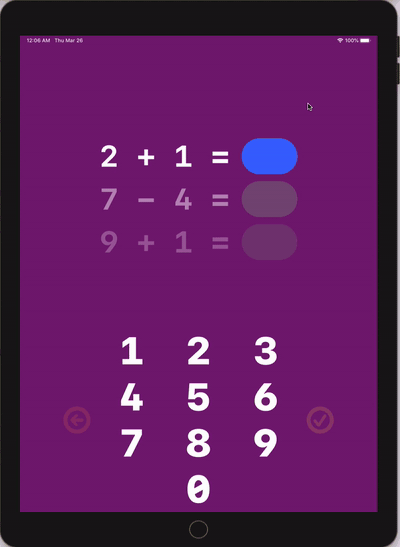

# Simple Math app

SimpleMath is an app that generates simple math equations for young children to help them solve and learn in a fun way. I've made this app for my 6 year old daughter because I don't have to write or print the equations and I don't need to evaluate them as well, the app does it all. 
I am very happy I can make my daughter's learning process easier, but this project has also given me a great "toy" to play around and learn / practice SwiftUI & Combine.
It is heavily inspired by Paul Hudson's recent [SwiftUI Live video](https://www.youtube.com/watch?v=FE4ys3tW1VI), I highly recommend it.

## Features

- [x] Generate addition and subtraction equations.
- [x] Record results and provide visual and audio feedback.
- [x] Show progress of completed equations as well as correct answers.
- [x] Display results after a completed session (10 equations at this time) with corrections on wrong answers.
- [x] An option to start a new session after finishing.
- [x] Display a simple cheerful animation if all problems are solved correctly.

    

## Todo

- [ ] The ui is made specifically for iPad 9.7 screen, allow support for multiple screen sizes and orientations.
- [ ] Results sheet can be dismissed by dragging, I need to investigate a clean way to solve this issue.
- [ ] Add app icon.
- [ ] Unit tests.
- [ ] Swiftlint support.
- [ ] Customize equation count & digit limit. 
- [ ] Ability to toggle sounds.
- [ ] Customize colors (it is very purple now, my target audience demanded it!).
- [ ] Multiplication and division.
- [ ] Flexible equation layout, ex `1 + _ = 3`.
- [ ] Adaptive sessions, use wrong answers from previous sessions, repetition is key!
- [ ] More gamification, with sounds and visual effects on streaks.
- [ ] Hints when tapping already completed wrong answers.
- [ ] Whatever my target audience demands!

## Is the app available on App Store?

No, at least not yet. As I mentioned in the todos, this app is "hard-coded" to work with iPad 9.7 inch screen and only in portrait mode which will make many unable to use it. Perhaps after that is resolved and some other items on the todo I will publish it as a free app on the app store. Everyone is welcome to download and build to device.

## Requirements

- iOS 13.0+
- Xcode 11.0+
- Swift 5.1+

## Author
* [Filip Lazov](https://github.com/filiplazov) ([@filiplazov](https://twitter.com/filiplazov))

## Credits
SimpleMath was inspired by the following projects:

* [SwiftUI Live: Building an app from scratch](https://www.youtube.com/watch?v=FE4ys3tW1VI) by [Paul Hudson](https://twitter.com/twostraws)
* [Build a SwiftUI App for iOS13](https://designcode.io/swiftui?promo=learnswiftui) by [Meng To](https://twitter.com/MengTo) (Design+code)

## License

SimpleMath is available under the MIT license. See the [LICENSE](LICENSE) file for more info.

All sounds in this project are made using Garage Band and are royalty free.